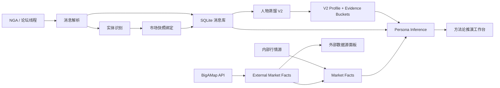

# Stock-Claw V2 项目文档

更新时间：2026-06-04

## 1. 项目定位

Stock-Claw V2 的核心目标是把“论坛人物观察 + 人物蒸馏画像 + 市场实时数据 + 外部结构化数据源”组合成一个可执行的本地投研工作台。

当前系统不再只是保存帖子和问答，而是围绕一个作者的长期方法论建立可追溯的证据体系，并在有行情、板块、涨停梯队等事实输入时，生成结构化推演。系统必须严格区分：

- 作者直接发言
- 人物画像归纳
- 当前市场事实
- 模型模拟推演
- 缺失输入和边界条件

V2 的重点不是让模型凭空判断市场，而是让模型在“历史经验为底座、近期言论为焦点、实时数据为约束”的框架下工作。

## 2. 当前已完成能力

### 2.1 V0/V2 论坛监听底座

后端已建立 V0 模块，用于承载当前的人物蒸馏和论坛监听能力。

主要能力：

- 论坛线程配置、抓取、解析和消息入库
- 重点作者识别
- 消息实体提取，包括股票、板块、市场结构信号
- 消息与市场快照绑定
- 任务运行记录和状态查询
- 飞书机器人推送
- 每日 digest 生成

主要文件：

- `server/src/v0/forum/*`
- `server/src/v0/shared/*`
- `server/src/v0/push/*`
- `server/src/v0/digest/*`
- `server/src/v0/routes.ts`

前端入口：

- `/v0/monitor`
- `/v0/messages`
- `/v0/one-shot-crawl`

### 2.2 人物蒸馏 V2

人物蒸馏 V2 已从简单标签升级为结构化画像。

当前画像包含：

- `summaryText`：人物方法论摘要
- `coreRules`：核心交易规则
- `marketMethodology`：市场判断变量、推理步骤、确认信号、失效信号、风险处理
- `decisionHeuristics`：决策习惯和启发式规则
- `expressionDNA`：表达方式和术语习惯
- `topicMap`：高频关注主题
- `evidenceQuality`：证据质量评估
- `contradictions`：潜在矛盾
- `honestBoundaries`：画像边界
- `agenticProtocol`：面向 Agent 的执行流程

证据桶已经扩展为：

- `longformTheory`
- `intradayDecision`
- `riskWarning`
- `sectorStockReasoning`
- `marketStructure`
- `expressionStyle`
- `recentSignals`
- `contradictionCandidates`

主要文件：

- `server/src/v0/persona/personaService.ts`
- `server/src/v0/persona/personaStore.ts`
- `server/test/v0_persona.test.ts`
- `server/test/v0_persona_distill.test.ts`

前端入口：

- `/v0/persona-demo`
- `/v0/persona-v2-demo`

### 2.3 Persona Inference：结构化方法论推演

当前已新增 `POST /api/v0/agent/persona-inference`，用于把 V2 画像、当日发言、近期发言、相关论坛消息、行情事实和外部市场事实合并成结构化推演。

请求要点：

- `query` 必填
- `authorName` 必填，或从 query 中解析
- `queryDate` 可选
- `eventText` 可选
- `stockHints` / `sectorHints` 可选
- `debug` 可选

响应结构：

- `summary`
- `methodologyBasis`
- `currentFacts`
- `evidencePack`
- `scenarioSimulations`
- `riskBoundaries`
- `missingInputs`
- `evidenceCitations`
- `marketFacts`
- `markdown`
- `debugTrace`

推演原则：

- 优先复用 V2 profileJson 和 Evidence Pack
- 当天无发言时必须显式说明，不把“无当天发言”等同于“不能分析”
- LLM 可用时要求输出纯 JSON
- LLM 不可用或 JSON 解析失败时返回本地 fallback
- 禁止把模型模拟写成作者本人当天观点

主要文件：

- `server/src/v0/agent/agentService.ts`
- `server/test/v0_persona_inference.test.ts`
- `client/src/features/v0/pages/V0PersonaV2DemoPage.tsx`

### 2.4 近期内容权重分析

当前 V2 页面已经包含近期权重分析入口，用于解决“全量历史画像过重、近期观点不够突出”的问题。

目标是让系统形成两层判断：

- 长期画像：作者稳定方法论和底层规则
- 近期焦点：最近发言中的阶段判断、风险偏好、方向变化和临时约束

这个能力目前处于初版，可用于辅助判断近期发言是否改变了长期画像中的默认策略。

主要文件：

- `server/src/v0/persona/personaService.ts`
- `client/src/features/v0/pages/V0PersonaV2DemoPage.tsx`

### 2.5 市场事实与实时联动

系统已经存在两类市场数据通道。

第一类是内部实时市场事实：

- 大盘概览
- 个股快照
- 板块快照
- 与论坛消息实体绑定的 marketStates

第二类是外部结构化数据源，目前接入 BigAMap：

- `points`：全市场股票点位、涨跌幅、成交额、行业、省份、申万分级等
- `maximized-rankings`：板块滚动强度排行
- `limit-up-review`：涨停板、连板梯队、封单强度、炸板次数等

后端接口：

- `GET /api/v0/market/facts`
- `GET /api/v0/market/external-facts`

主要文件：

- `server/src/v0/market/marketBinding.ts`
- `server/src/v0/market/marketFacts.ts`
- `server/src/v0/market/bigamapProvider.ts`
- `server/src/v0/market/externalMarketFacts.ts`
- `server/test/v0_market_facts.test.ts`

前端入口：

- `/v0/external-data`

当前外部数据页面已单独拆出，不再放在人物方法论页面里。页面以模块跳转形式展示：

- 板块轮动
- 选股器
- 机构多空单
- 涨跌停板行情
- 均线顶底指标
- 龙虎榜复盘

其中已接入并可视化的重点是：

- BigAMap 源状态
- 板块轮动
- 涨停梯队
- 市场广度
- 股票强度

## 3. 当前架构



## 4. 数据边界和风险

### 4.1 数据源风险

当前外部市场事实依赖公开接口，不保证长期稳定。

BigAMap 已接入的接口：

- `https://api.bigamap.cn/api/v1/public/map/points`
- `https://api.bigamap.cn/api/v1/public/map/boards/maximized-rankings`
- `https://api.bigamap.cn/api/v1/public/map/limit-up-review`

后续需要补充：

- 请求失败降级
- 缓存策略
- 数据时效标记
- 字段版本兼容
- 接口变更告警

### 4.2 推演边界

Persona Inference 的输出不是作者本人观点，也不是投资建议。

系统必须持续保留以下边界：

- 没有当天发言时，要明确标注“无直接证据”
- 行情事实缺失时，要列入 `missingInputs`
- 新闻未接入时，不主动臆造新闻细节
- 情景推演必须给出触发条件和失效信号
- 置信度必须受证据质量、实时数据完整度、近期发言覆盖度共同约束

### 4.3 法务和产品边界

当前项目用于本地研究和辅助分析，不应包装成自动交易系统。

需要避免：

- 明示确定收益
- 输出无边界的买卖建议
- 把论坛作者画像包装成权威信号
- 对外部数据源做未授权商业分发

## 5. 开发与验证

后端：

```bash
cd server
npm install
npm run build
npm run test:v0
npm run dev
```

前端：

```bash
cd client
npm install
npm run build
npm run dev
```

常用页面：

- `http://localhost:5173/v0/monitor`
- `http://localhost:5173/v0/messages`
- `http://localhost:5173/v0/persona-demo`
- `http://localhost:5173/v0/persona-v2-demo`
- `http://localhost:5173/v0/external-data`

核心测试：

- `server/test/v0_persona.test.ts`
- `server/test/v0_persona_distill.test.ts`
- `server/test/v0_persona_inference.test.ts`
- `server/test/v0_market_facts.test.ts`
- `server/test/v0_agent.test.ts`

## 6. 下一阶段开发计划

### P0：稳定 V2 数据联动闭环

目标：让“作者发言 -> 人物画像 -> 市场事实 -> 方法论推演”成为稳定主流程。

任务：

- 强化 `V0MarketFactsService` 的事实分层：指数、个股、板块、涨停、广度、机构行为
- 把 BigAMap facts 更完整地注入 Persona Inference，而不是只作为附加引用
- 给每个 market fact 增加时效、来源、置信度、适用范围
- 在推演工作台里把“历史画像”和“近期言论”拆成两个权重区块展示
- 增加“近期发言是否修正长期画像”的显式判断

验收：

- 同一个 query 在有无 BigAMap 数据时，输出差异可解释
- 无当天发言时，仍能基于画像和事实推演，但边界清楚
- 前端能看出每个情景依赖了哪些证据桶和市场事实

### P1：外部数据源平台化

目标：把 BigAMap 从单点接入升级为可扩展的数据源适配层。

任务：

- 抽象 `ExternalMarketProvider`
- 为每个数据源定义 source health、schema version、generated_at、quote_delay_notice
- 增加本地缓存，减少重复请求和接口波动影响
- 拆分 BigAMap 子模块：
  - 全市场股票 points
  - 板块滚动强度 rankings
  - 涨停复盘 limit-up-review
  - 后续补充机构观测、均线指标、龙虎榜等
- 增加外部数据源面板的源诊断视图

验收：

- 单个源失败不影响其他源返回
- 前端能看到每个源的成功、失败、缺失和更新时间
- 后端测试覆盖异常、空数据、字段缺失和 topN 边界

### P2：新闻系统重建

目标：在暂缓旧新闻快讯问题后，重新设计可控的新闻事实层。

任务：

- 先定义 `NewsFact` 结构，不急于接入多个新闻源
- 新闻事实必须包含标题、时间、来源、相关股票/板块、摘要、置信度
- 建立新闻与市场事实、作者发言的三方关联
- Persona Inference 中新增“外部事件事实”区块
- 给新闻源接入增加降级和缓存

验收：

- 用户输入事件文本时，系统能把它作为当前事实
- 有新闻事实时，系统能区分新闻本身和模型解读
- 新闻缺失时不会臆造事件细节

### P3：推演工作台产品化

目标：把当前演示页升级为日常可用的分析桌面。

任务：

- 推演结果支持复制、导出和固定
- 情景卡片支持按概率、置信度、风险排序
- Evidence Pack 支持按桶过滤、按时间过滤
- 近期权重分析支持时间窗配置
- 增加“事实采集表单”：盘前、开盘 15 分钟、午盘、收盘
- 增加“执行检查清单”：触发条件、失效信号、缺失数据

验收：

- 用户能从页面直接完成一次完整分析，不需要看原始 JSON
- 每个结论都有证据引用
- 页面结构不再依赖长 Markdown

### P4：画像版本管理

目标：让人物画像可追踪、可比较、可回滚。

任务：

- 增加 profile version 表
- 保存每次重建参数、证据池、LLM 使用情况和 fallback 状态
- 支持 V1/V2 画像对比
- 支持“近期重建”和“全量重建”并存
- 增加手动修正记录

验收：

- 每次画像变化可以解释
- 历史版本可以恢复
- 近期发言导致的画像变化有明确证据链

## 7. 推荐近期开发顺序

建议下一轮按以下顺序推进：

1. 先做 `Market Fact v2`：统一内部行情和 BigAMap 外部事实的事实结构。
2. 再做 `Recent Focus Layer`：让近期言论在推演中有明确权重和冲突判断。
3. 然后做 `Inference UI v2`：把市场事实、证据桶、近期焦点、情景推演拆成清晰区域。
4. 最后重建 `News Fact`：在市场联动稳定后再接新闻，避免事实层混乱。

这样可以先把当前最核心的“数据联动”闭环稳定下来，再扩展新闻系统和画像版本化。

## 8. Git 和 Skill 说明

当前主仓库：

- remote：`https://github.com/Adam-byxiao/stock-claw.git`
- branch：`main`

当前 skill 以 submodule 形式挂载：

- path：`skill/colleague-skill`
- remote：`https://github.com/titanwings/colleague-skill.git`
- branch：`dot-skill`

克隆主仓库后需要拉取 submodule：

```bash
git submodule update --init --recursive
```

如果后续 skill 本身有改动，需要先在 `skill/colleague-skill` 内单独提交并推送，再回到主仓库提交新的 submodule 指针。
